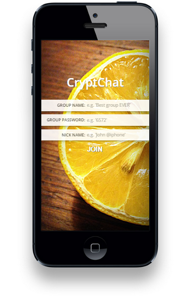
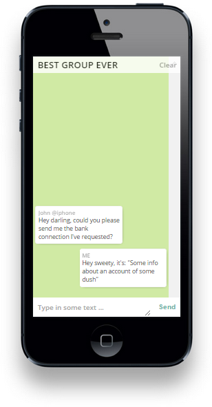
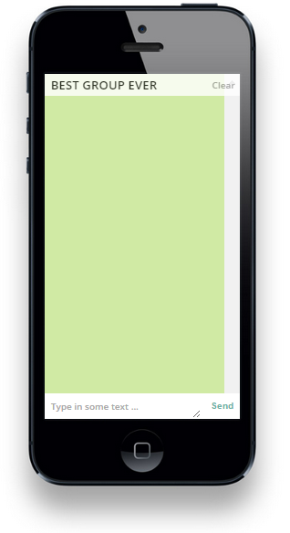

#CryptChat

*A safe, anonymous, web based group chat.*

- Homepage: [https://github.com/loehx/CryptChat](https://github.com/loehx/CryptChat)
- Example page: [https://loehx.eltanin.uberspace.de/cryptchat](https://loehx.eltanin.uberspace.de/cryptchat "https://loehx.eltanin.uberspace.de/cryptchat")

With CryptChat you can ceate or join group/chatroom, and send and receive messages, which can be only read by the ones who have the same password.

The difference to other chat applications, is that there is a password, which is stored in the browser and it won't leave your device. The server has no idea about the password, only the encrypted message and nickname will be transferred to the server and forwarded to all participants. All participants need the same password, because without they won't be able to decrypt the message and nickname.

Another difference is that the chatrooms are not saved on the client nor server hard disk. It only exists in the internal memory of your device, as well as the receivers who have the right password. The server does the same, plus the messages are encrpted.

As the password encryption wouldn't be enough, the example website runs over HTTP*S* and guarantees even more security.

##Example

1. *John @iphone* creates a new group named "Best group EVER" and enters the password "9372".
2. *Berta @pc* (his wife) enters the same password and joins the group.
3. *John @iphone* writes: `Hey darling, could you please send me the bank connection I've requested?` and presses 'send'.
	1. What  happens now, is that the message and his nickname gets encrpted by the mentioned password and the result will be sent to the server: 
	2. `sender: "U2FsdGVkX18ieaqarwui1RYXl9gDC1LVy6OWQji9dN0="`
	3. `text: "U2FsdGVkX18WA681OhYRJGUDq1+WcPm4wKvqerB1bNgDvlZpc95f81Cd6l+XkA/1Jz5Z2o1uywPaoWbx7wHjGKoT4WzAXWQycouQ304BPuxglAwtgWldb8sNchC5uyCv"`
4. *Berta @pc* now receives this data and because she entered the right password, she is able to read the message. She answers: `Hey sweety, it's: "Some info about an account of some dush"`

5. Suddennly *Carry @android* (the secret mistress of John) tries to join the group, but types in a wrong password: "7462". And so she sees the following:  
6. She doesn't even now that there is a chat...

##Devices

This application is optimized for iphone, but can also be used on desktop PCs or MACs.

The following devices are supported at the moment:

- iPhone 4,5,6
- PC or MAC
	- Chrome
	- Internet Explorer > 9
	- Firefox
	- Safari

Other devices will follow:

- Android Smartphone
- Android Tablet
- iPad

##Features

- **Double tap** on the chat puts the cursor into the message input, ready to type.
- **Clear**-button in the top left corner deletes the whole chat history on the clients', as well as on the server side.

##Change log

- **v0.1.0** Beta version